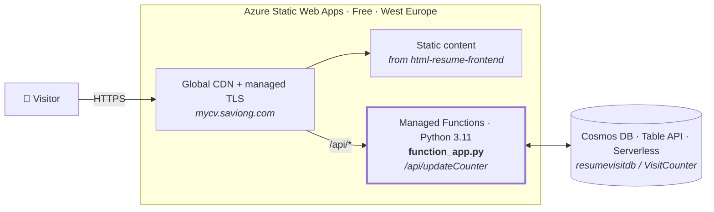
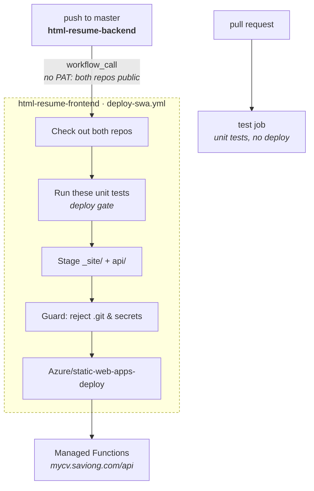

# 📝 Savio Ng – Interactive HTML Résumé (Backend)

The API behind my [HTML Résumé](https://mycv.saviong.com): a Python **Azure Function**
that serves a visitor counter backed by **Azure Cosmos DB (Table API)**.

It runs as a **managed function inside the Static Web App**, served same-origin at
`/api`. There is no standalone Function App — `resumevisitor-fn` was decommissioned in
September 2026.

---

## 🏛️ Where this code runs



---

## ⚙️ How It Works

1. The page calls `/api/updateCounter` — same origin, so no CORS preflight.
2. The function takes the client IP from `x-forwarded-for`, **stripping the ephemeral
   port**, and uses it as the row key.
3. It tries to `create_entity` for that IP. Success means a first visit. If the row
   already exists, it counts only when the last visit was over an hour ago.
4. When it counts, the total is incremented under **ETag optimistic concurrency**, so
   overlapping requests cannot lose an increment.
5. Returns JSON:

```json
{ "count": 123 }
```

### Table layout

One table (`VisitCounter`) holds both partitions:

| PartitionKey | RowKey | Fields | Purpose |
|--------------|--------|--------|---------|
| `counter` | `visits` | `count` | The running total |
| `visitor` | *client IP* | `lastVisit` | Per-IP hourly throttle |

---

## 📂 Key Files

| File | Purpose |
|------|---------|
| `function_app.py` | The HTTP-triggered function (Python v2 programming model). |
| `requirements.txt` | `azure-functions`, `azure-data-tables`. |
| `host.json` | Functions host configuration. |
| `test.py` | Unit tests (9 cases), run in CI. |
| `local.settings.json` | Local development only — git-ignored, never deployed. |
| `.github/workflows/ci.yml` | Runs the tests. Does **not** deploy. |
| `template.json` / `parameters.json` | Legacy ARM export. Stale — describes the retired architecture. |

---

## 🔑 Environment Variables

Set on the **Static Web App** (Configuration → Application settings):

| Setting | Notes |
|---------|-------|
| `COSMOS_CONNECTION_STRING` | Cosmos DB Table API connection string. |
| `TABLE_NAME` | Currently `VisitCounter`. The code defaults to `VisitorCounter`, so if this is ever unset the function silently reads a **different, empty** table. |
| `ALLOWED_ORIGINS` | Optional comma-separated CORS allow-list; defaults to `*`. Unused while the API is same-origin. |

> **Note:** the function emits its own `Access-Control-Allow-Origin`. If it is ever
> hosted somewhere with platform-level CORS, leave that allow-list empty — two
> `Access-Control-Allow-Origin` headers cause browsers to reject the response.

> Managed functions reserve the `AzureWeb*` app-setting prefix, so
> `AzureWebJobsFeatureFlags` cannot be set here. It is not needed: the v2 decorator
> model indexes correctly under `apiRuntime: python:3.11`.

---

## 🛠️ CI/CD

**A push to `master` here deploys to Azure automatically.**

Static Web Apps publishes the static content and the managed API as one atomic
upload, so this repo cannot deploy in isolation — the site has to be republished
with it. Rather than duplicate that logic, `ci.yml` calls the frontend repo's
reusable workflow, which checks both repos out, tests this code, and publishes
them together.



```yaml
# .github/workflows/ci.yml
deploy:
  uses: saviong/html-resume-frontend/.github/workflows/deploy-swa.yml@master
  secrets:
    AZURE_STATIC_WEB_APPS_API_TOKEN: ${{ secrets.AZURE_STATIC_WEB_APPS_API_TOKEN }}
```

Pull requests run the tests and deploy nothing. On `master` the separate `test` job
is skipped, because the deploy runs the same tests as its gate.

### Required secret

| Secret | Purpose |
|--------|---------|
| `AZURE_STATIC_WEB_APPS_API_TOKEN` | Passed through to the reusable workflow |

> A push here republishes `master` of the frontend too. If you have unpushed
> frontend work, it will not be included — that is inherent to the atomic upload.

> If `/api/*` ever returns a bare `404` with no error anywhere, the usual cause is that
> `requirements.txt` was not installed: the Python worker cannot import its dependencies,
> so no functions are indexed. The GitHub Action lets Oryx install them; the local
> `swa deploy` CLI skips Oryx, so it needs them vendored into
> `api/.python_packages/lib/site-packages` instead.

---

## 🧪 Testing Locally

```bash
pip install -r requirements.txt
python -m unittest test -v
```

To run the function host locally, set `COSMOS_CONNECTION_STRING` in
`local.settings.json` first:

```bash
func start
curl http://localhost:7071/api/updateCounter
```
